# 軽量ハザードマップアプリ説明

１．コンセプト
=======

   サーバー費用無料でハザードマップのWEB配信を行う

   プログラムのソースコードはオープンソースとする

   権限を持ったユーザが地図に情報を書き込み、WEB地図で共有を行えるようにする

２．実現するための技術
===========

 Google Spread Sheetのアカウントを作り、そこにWEB地図関連パラメータの定義、ポイントデータを格納する。

それらのデータにアクセスするためのWEB APIと地図表示用WEBページをGoogle App Scriptとして記述を行いGoogle App Script編集画面からデプロイを行う。

データ編集可能なモードのWEB地図ソフトウェアと閲覧専用地図ソフトウェアを別に用意。編集可能ソフトウェアはGoogle Spread Sheetのメニューから起動。当該Google Spread Sheetの編集権限があり、ユーザーリストにメールアドレスが登録されてあるユーザでSpread Sheetにログインしている場合のみ利用可能（Google Spread Sheetのユーザ権限でユーザ管理）。閲覧専用ソフトウェアは外部WEBサイトのHTMLからWEB API利用で地図データを取得して表示を行う（今回のプロトタイプはGithubを利用）。

地図データとしては背景図に地理院ベクタタイル、地理院ラスタタイルを利用。ハザードマップデータとしては国土地理院ハザードマップポータルを利用している。またユーザが登録可能なポイントデータをGoogle Spread Sheet内に格納して利用している。

Google Spread Sheet,Githubの基本機能は無料で利用できる。サーバー費用無料で運用することも可能であるため本ハザードマップは運用のための費用を低くすることが可能である。

* * *

３．機能説明
======

3.1  ハザードマップ閲覧モード
-----------------

### ３．１．１ 起動

指定URLをWEBブラウザで開く（サンプルだと[https://akbousai.github.io/lhazardmap/](https://www.google.com/url?q=https://akbousai.github.io/lhazardmap/&sa=D&source=editors&ust=1679912953215595&usg=AOvVaw1ZcZtjX-biRQ8I1kYd8D0u) ）

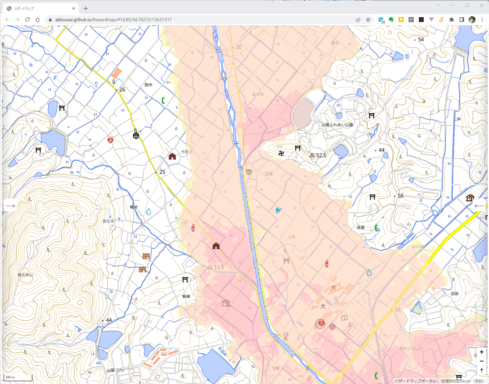

### ３．１．２ ハザードマップ表示指定

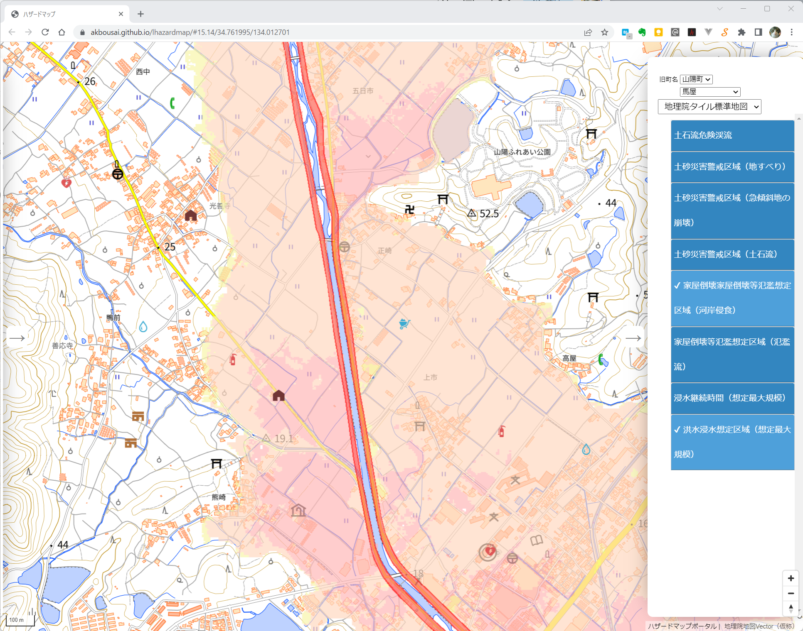

右側パネルに表示されるハザードマップのリストをマウス左ボタンでクリックするとそのハザードマップの地図表示が切り替わる（非表示ー＞表示 または 表示ー＞非表示）

### ３．１．３ 凡例表示

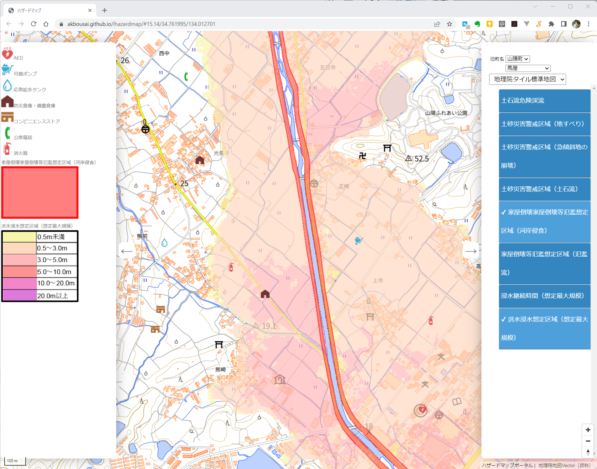

左側パネルを開くとその時点で表示指定されているハザードマップの凡例が表示される。

### ３．１．4 登録情報表示

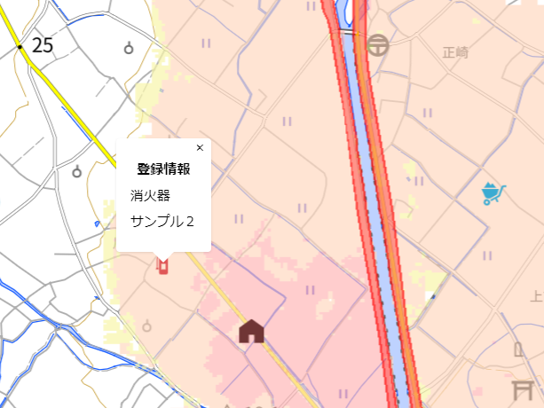

地図上に表示されているアイコンをマウス左ボタンでクリックすると当該位置に登録された情報の種別と登録したテキストがポップアップで表示される。

### ３．１．5 背景図切り替え

右側パネルの上部3番目のドロップボックスで背景図の切り替えを行うことができる

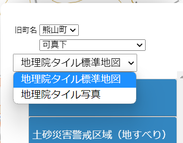

* * *

### ３．１．6 地図拡大・縮小・スクロール

地図右下の ＋- コントロールボックスのクリックで地図の拡大・縮小を行うことができる。マウスセンターホイールの操作でも拡大・縮小を行うことができる。

地図上でマウス左ボタンを押してそのままドラッグすると地図のスクロールをすることができる。

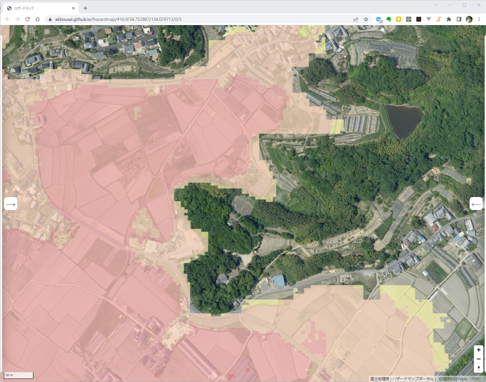

マウス右ボタンを地図上で押してドラッグすると地図を表示する角度を変えることができる。地図右下のコンパスの針のボタンをクリックすると表示が通常の角度に戻る。

### ３．１．7  地名選択による地図表示位置の移動

右パネル上部の旧町名選択リストで旧町名を選択するとその下の地名リストが指定地域に属する地名のリストに切り替わる

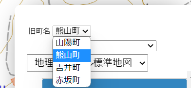

そのリストで地名を選択すると地図が指定した地点近辺を中心とした表示になる

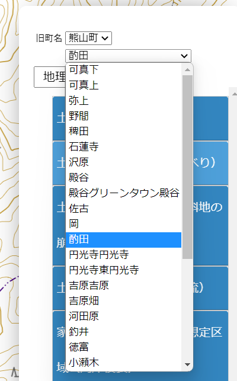

選択地点近辺の地図

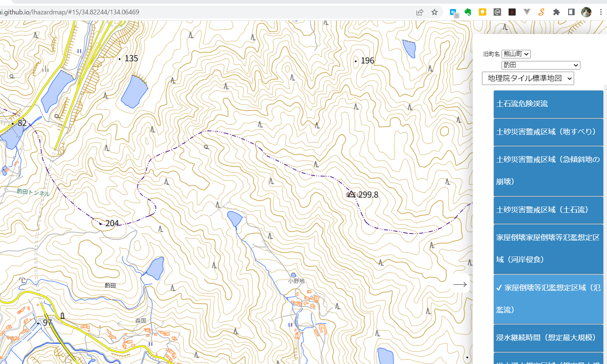

* * *

3.２  地域情報入力モード
--------------

### ３．２．１ 起動

当該Google Spread Sheetのメニューに「地図機能」というものがあるのでそこから「地図を開く」を選択する。（ブラウザの設定でGoogle Spread Sheetからのポップアップを許可しておく必要がある）

-----------------------

起動すると以下のように地図がブラウザ別タブに表示される

３．２．２ 地域情報入力

ハザードマップ閲覧モードのWEB地図では地図上をマウス左ボタンでクリックするとそこに登録情報のアイコンがある場合は登録情報を表示するポップアップが表示される。

地域情報入力モードの地図の場合は地図上をマウス左ボタンでクリックした場合は閲覧モードと同じ処理になるモードと、当該位置に新規にデータ登録を行う2種類の状態を切り替えることができる。

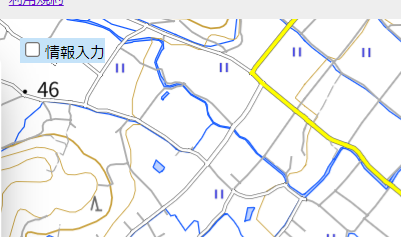

地図画面左上に「情報入力」というテキストがついたチェックボックスがある。

このチェックボックスがチェックされていない状態の時は閲覧モードと同じで、マウス左ボタンで地図をクリックしたときにその位置にアイコンがあればアイコンに登録されている情報を表示するポップアップが表示される。

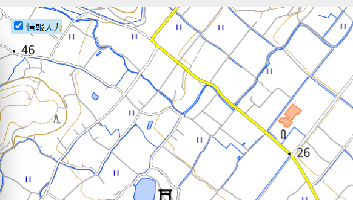

チェックボックスをチェックした後に地図上の情報登録したい位置をマウス左ボタンでクリックする。

* * *

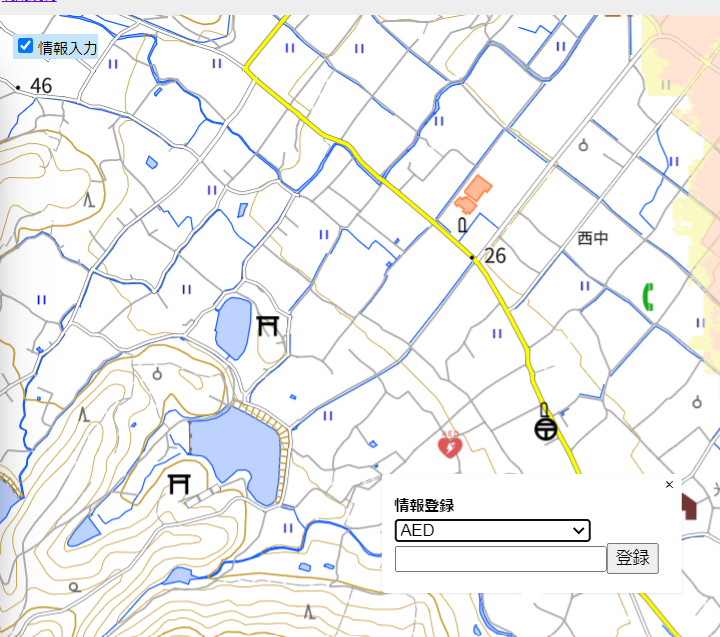

上図のように情報登録用ポップアップが表示される。

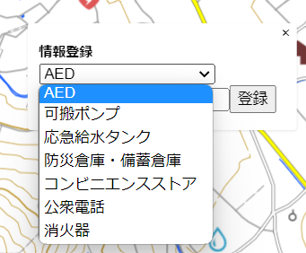

ドロップダウンリストから登録データの種別を選択

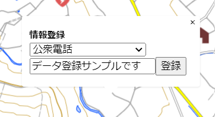

説明テキストを入力してから「登録」ボタンをクリックする

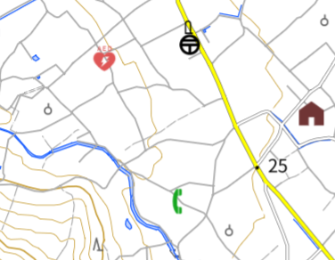

指定位置にアイコンが表示される

### ３．２．３ 入力情報編集・削除

入力した地域情報は「シート１」というシートに1行のデータとして登録される。

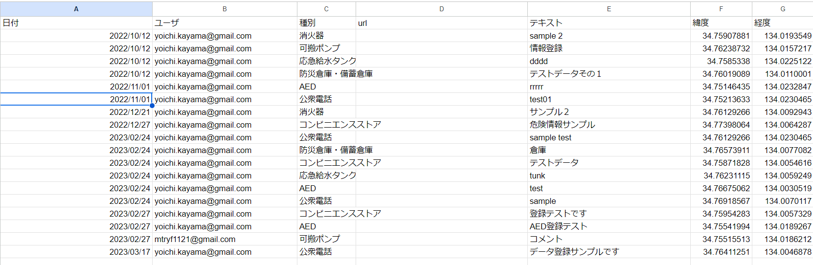

シート1内の登録情報のカラムを編集することでデータ内容の編集を行うことができる。

また当該データ行を削除するとデータの削除を行うことができる。

* * *
[システム設定手順](./install.md) 

--------------

本プログラムは一般社団法人トヨタ・モビリティ基金様のプロジェクトで作成しました。
