# サイト作成のための手順

１ Google Spread Sheetの準備
--------------------------

  [https://docs.google.com/spreadsheets/d/1uQbImdh41UQ3L\_C8HDfGoGsoPgNfBQis4ZGa0O1MVrg/edit?usp=sharing](https://www.google.com/url?q=https://docs.google.com/spreadsheets/d/1uQbImdh41UQ3L_C8HDfGoGsoPgNfBQis4ZGa0O1MVrg/edit?usp%3Dsharing&sa=D&source=editors&ust=1679912953223242&usg=AOvVaw0VBCUkmswVqPZQQvfSHojb)  サンプルのシート

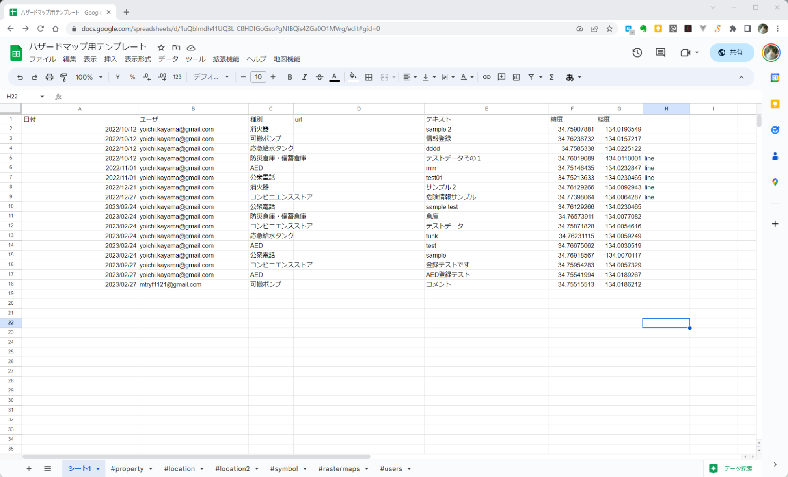

以下のようなシートを用意する

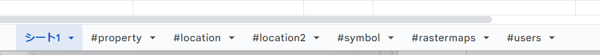

シート１   ユーザ定義のポイントデータを格納

#property         デプロイURL  初期表示中心位置

#location   位置選択用リスト１  

#location2  位置選択用リスト2

#symbol           シンボル定義

#rastermaps    ハザードマップ定義

#users   編集可能ユーザ登録

#location1     地域選択情報（最上階層)

#location2     地域選択情報  (サブ階層）

## 1.1 シート1    

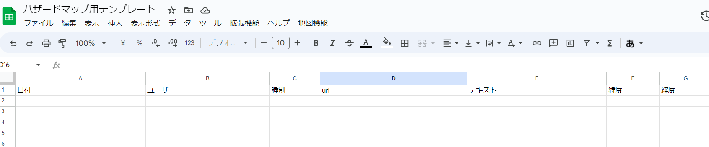

1行目はヘッダで各カラムに格納されるデータの名称が記述される。

日付

ユーザ

種別

url

テキスト

緯度

経度

2行目以降はデータ編集地図から入力されたデータが格納される

## 1.2 #property   シート

システム全体の動作情報を定義する

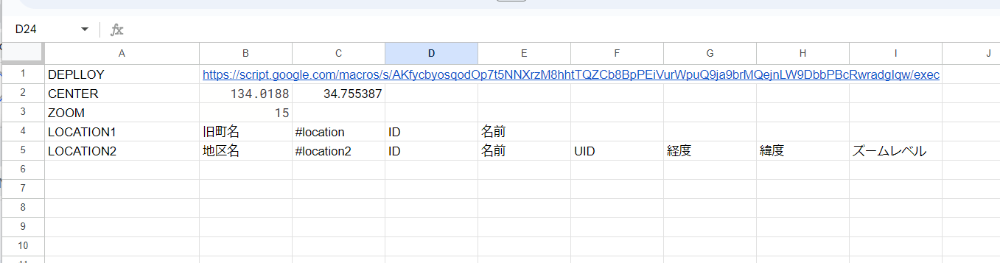

1行目  DEPLLOY   システムdeployURL（システム機能を公開しているURL）

2行目  CENTER   初期表示位置  経度 緯度

3行目       ZOOM               初期表示ZOOMレベル（拡大パラメータ）    8-17 の整数

                            数字が大きいほど拡大される

４行目     LOCATION１          最上レベル地域選択ドロップボックス情報

                                           利用しない場合は B-D のカラムには値をいれない

５行目     LOCATION２          第2レベル地域選択ドロップボックス情報

                                           利用しない場合は B-I のカラムには値をいれない

## 1.3 #symbol シート

ユーザがポイント登録するときのポイントの種類を表すシンボルを定義する。

ここのシートに行を追加するとポイントの種別とそれを地図に表示するシンボルを追加できる。

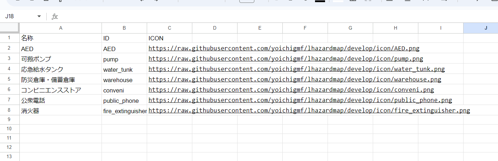

1行目  ヘッダ

2行目以降  シンボル定義  

名称

ID

ICON

名称   ポイント種別名称   ポイント入力機能で入力時にリストに表示

                凡例に表示

ID    プログラム内部での識別子  

ASCII文字（アルファベット、数字、半角）で他の行のアイテムと同じではない文字列で指定

URL  アイコンの画像ファイル  png 形式が格納されている URL

    インターネットでアクセス可能な場所

    現状のアイコンは  32ドット×32ドット

## 1.4 #rastermaps シート

地図に重ね合わせ表示を行うハザードマップの定義を行う。

現状で国土地理院のハザードマップポータルサイトで公開されているラスタタイルデータを指定している。

[https://disaportal.gsi.go.jp/hazardmap/copyright/opendata.html](https://www.google.com/url?q=https://disaportal.gsi.go.jp/hazardmap/copyright/opendata.html&sa=D&source=editors&ust=1679912953231758&usg=AOvVaw0Xs1CzaBAFlv3cqqF6YyCO)

ラスタのXYZタイル形式で公開されているデータならば追加で定義可能。

[https://maps.gsi.go.jp/development/siyou.html](https://www.google.com/url?q=https://maps.gsi.go.jp/development/siyou.html&sa=D&source=editors&ust=1679912953232516&usg=AOvVaw1Jnr3jGdet61iRT0gTTJk8)  地理院タイルについて（ラスタタイルの仕様）

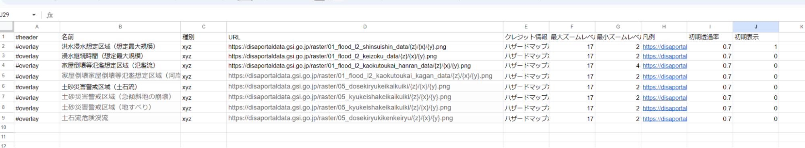

1行目 ヘッダ

2行目以降  重ね合わせ地図の定義

#header

名前

種別

URL

クレジット情報

最大ズームレベル

最小ズームレベル

凡例

初期透過率

初期表示

名前   重ね合わせ災害情報の名称

種別 ラスタタイルの形式    (今回は xyz 固定）

URL ラスタタイルのURL

クレジット情報    ラスタタイル表示時に地図に表示するクレジット情報

最大ズームレベル    ズームレベル最大値 （最大18    最小0 の数値）

最小ズームレベル    ズームレベル最小値 （最大18    最小0 の数値）

凡例   凡例画像のURL

初期透過率     表示を行う場合の透過率   最大 1.0 ー 最小 0.0

                        1.0  だと透過しない    0.0  だと透明

初期表示    システム立ち上げ時に表示するかどうかの指定

                        1   表示する      0   表示しない

## 1.5 #users シート

編集モードを利用できるユーザのIDを定義する。

編集モードでポイントデータを追加できるのは当該Google Spread Sheetの編集権限をもち、かつここのシートにmailアドレス（Gmailアドレス）が定義されているユーザのみである。（誰でもデータが登録できる形にはしていない）

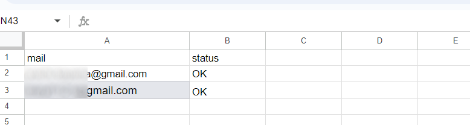

1行目     ヘッダ

2行目以降   編集モードを許可するユーザのgmail アドレス

これらユーザには Google Spread Sheetの「共有」機能で当該シートへの編集権限を与えておくこと

mail

status

mail     ユーザのメールアドレス

status    OK  の場合編集モードでのログイン可能

２  Google AppScript の設定
-------------------------

## ２．１ サンプルのGoogle Spread Sheetをスクリプト付きでコピーした場合

webmap.gs GetFeaturesGeoJSON.gs   index.html  の3ファイルがシートの添付スクリプトとしてコピーされる。

また新規Google Spread Sheetにこのスクリプトを設定したい場合は以下のGithubリポジトリのmainブランチのファイルを利用する。

  [https://github.com/akbousai/lhazardmap](https://www.google.com/url?q=https://github.com/akbousai/lhazardmap&sa=D&source=editors&ust=1679912953240193&usg=AOvVaw27FhhzGd2P-UDj8nIF9HH9)

## ２．２ Google Spread SheetにGoogle AppsScriptを設定する

Google Spread Sheetの拡張機能メニューから「Apps Script」を選択するとScriptの編集や設定が可能になる。

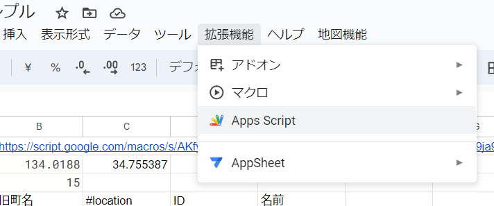

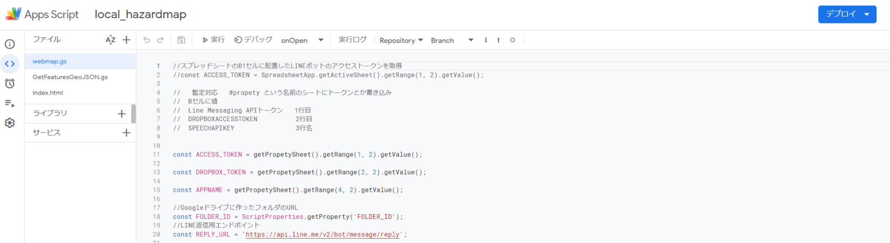

* * *

## ２．３ Google AppsScriptのデプロイ

デプロイとは指定プロジェクトのGoogle Apps Scriptをインターネットからアクセスできるように公開する作業である。

エディタ画面右上の「デプロイ」メニューで「新しいデプロイ」を実行する。

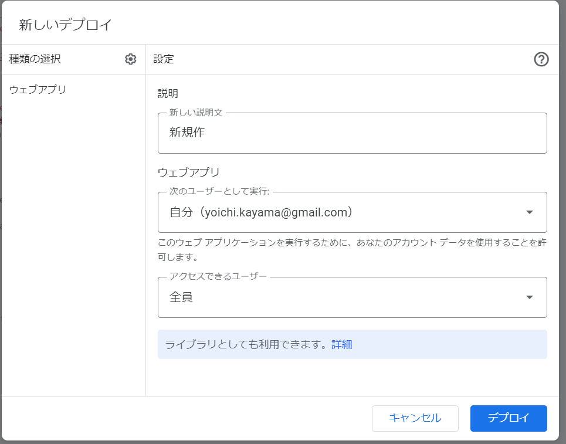

上記ダイアログボックスが表示される。

種類は「ウェブアプリ」

アクセスできるユーザは「全員」

説明はわかりやすい言葉

を記入、選択して「デプロイ」ボタンをクリックする

ユーザ（実行ユーザ）への「アクセス承認」ボタンが表示されるのでクリックする。

Gmailユーザでログインすると上記画面が表示される（Google はこのアプリケーションを検証していない という警告）

ここでは「Advanced」をクリックする

作成した人のメールアドレスが表示され,その開発者が信頼できるなら続行しなさいというメッセージが表示される。

その下の Go to local\_hazardmap (unsafe)   をクリックする

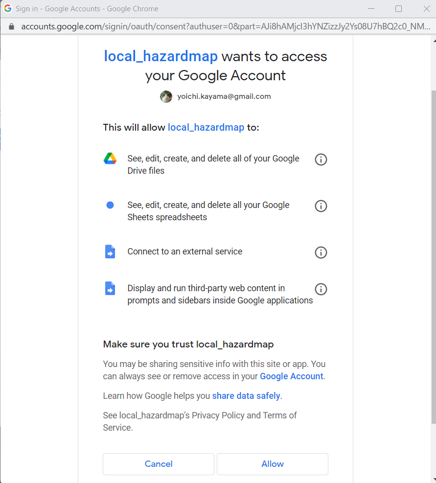

local\_hazardmap を実行時に利用許可する項目が表示される

「Allow」をクリックする。

デプロイの結果が表示される。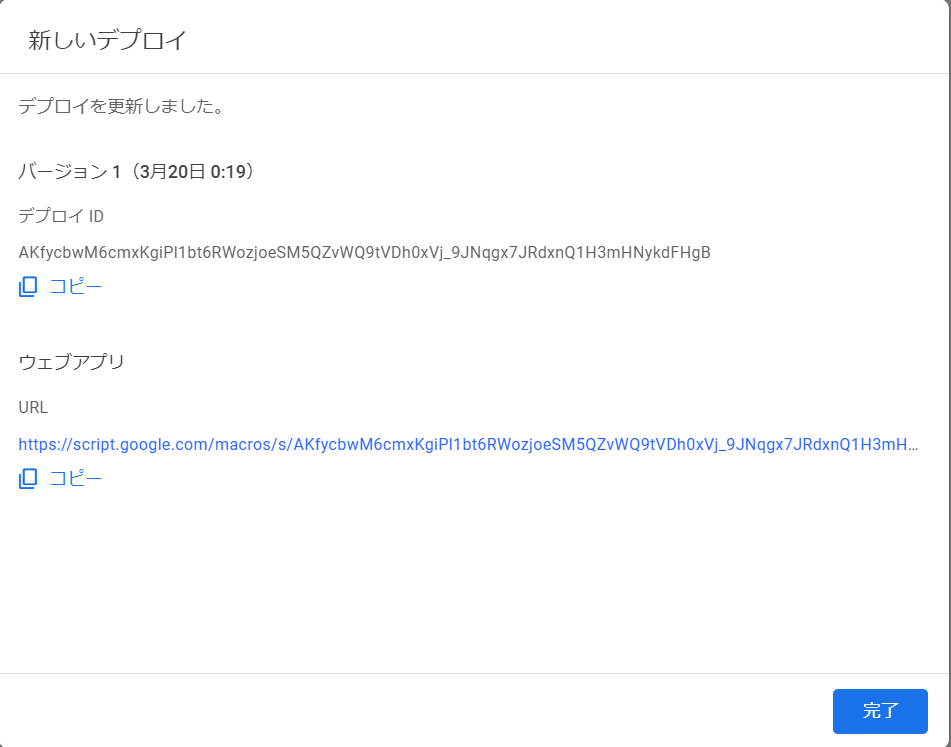

ここの「ウェブアプリ」のURLをコピーしておく

## ２．４ SpreadSheet の #property シートの設定

 前節で作成した デプロイURLの文字列を  #property シートの 1:B のセルにコピーする

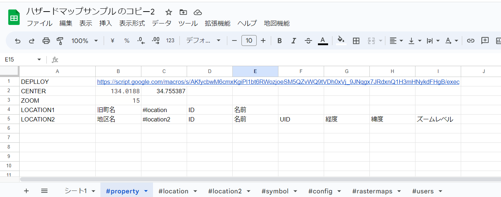

## ２．5  地域情報入力モードの起動確認

Google Spread Sheet 表示時のブラウザポップアップを許可する。

「地図機能」メニュー 「地図を開く」 を選択

ブラウザの別タブで地図画面が開くことを確認

3 ハザードマップ閲覧モードサイトの公開
----------------------

ハザードマップ閲覧モードのWEB地図は [https://github.com/akbousai/lhazardmap](https://www.google.com/url?q=https://github.com/akbousai/lhazardmap&sa=D&source=editors&ust=1679912953247144&usg=AOvVaw2vFTzxyVa_Kgq6RWF1pTkj)  の gh-pages ブランチ  [https://github.com/akbousai/lhazardmap/tree/gh\_pages](https://www.google.com/url?q=https://github.com/akbousai/lhazardmap/tree/gh_pages&sa=D&source=editors&ust=1679912953247623&usg=AOvVaw1RJg6BuTMUYch9eqtsVba8) のソースコードをhttp でアクセスできる場所に公開すると利用できる。

この時ソースコード内にデプロイURLを書き込んでいる場所があるが、それを利用しているGoogle Spread SheetのデプロイURLに書き換える必要がある。

Githubに無料でWEBページを公開する仕組みがあるのでそれでの利用例を紹介する。

## 3．１ Github pages の仕組み

Githubにはgithub pages という名前のWEBページ公開の仕組みがある。

GitHub Pagesについて

[https://docs.github.com/ja/pages/getting-started-with-github-pages/about-github-pages](https://www.google.com/url?q=https://docs.github.com/ja/pages/getting-started-with-github-pages/about-github-pages&sa=D&source=editors&ust=1679912953248775&usg=AOvVaw0x-sxt7B3EEXtk9kctRupb)

GitHub Pagesサイトを作成する

[https://docs.github.com/ja/pages/getting-started-with-github-pages/creating-a-github-pages-site](https://www.google.com/url?q=https://docs.github.com/ja/pages/getting-started-with-github-pages/creating-a-github-pages-site&sa=D&source=editors&ust=1679912953249558&usg=AOvVaw0pSOaZYDhVyua4vY1HJGmG)

* * *

## 3．２ デプロイURLの設定

gh\_pages ブランチにある index.html  ファイルに デプロイURLが記入されている。

ここのURL文字列を 4.2.3節で作成したデプロイURLに置き換えたものを保存する（コミットする）。その状態でgh\_pagesブランチを githup pagesとして公開すると閲覧モードのWEB地図として公開できる。

Github上のソースはクライアントにCloneして編集してpushして更新するやり方が一般的である。またGithubのWEBページ上でも編集可能である。（編集権限があるリポジトリの場合）

Forkして自分の管理領域に作成したリポジトリの場合編集可能であると思われるのでWEBページでの編集が可能である。

下記のように gh\_pages ブランチの index.html を表示して右側の鉛筆ボタンをクリックするとWEB画面上でindex.html を編集できる。

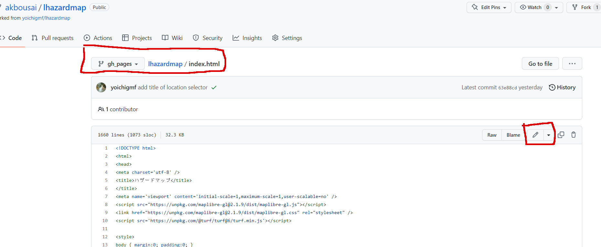

732行目の    

  dpurl \= "https://script.google.com/macros/s/AKfycbwM6cmxKgiPl1bt6RWozjoeSM5QZvWQ9tVDh0xVj\_9JNqgx7JRdxnQ1H3mHNykdFHgB/exec";

という記述のダブルクォーテーション内のURL文字列をあらたに作成したデプロイURLで書き換える

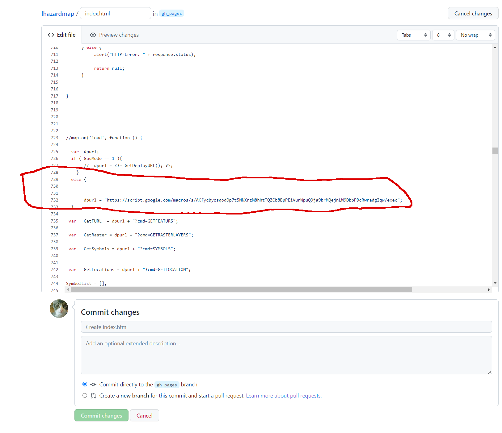

画面下部の Commit changes  のところで変更についてのコメントを記述して「Commit changes」ボタンをクリックすると修正が適用される。このとき gh\_pages ブランチに対するコミットオプションを有効にしておくこと

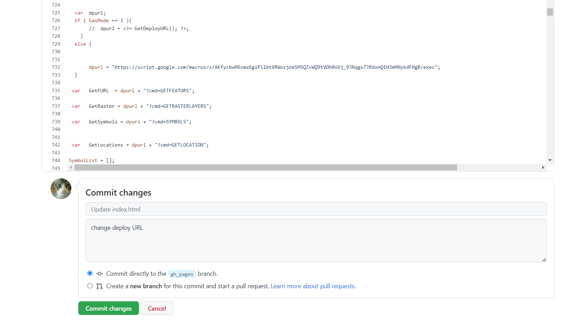

* * *

指定リポジトリの「Settings」ボタンをクリックして左側の「Pages」ボタンをクリックするとGithub Pagesの設定画面になる。

ここで各種情報を設定すると指定コードをWEBページとして公開することができる。

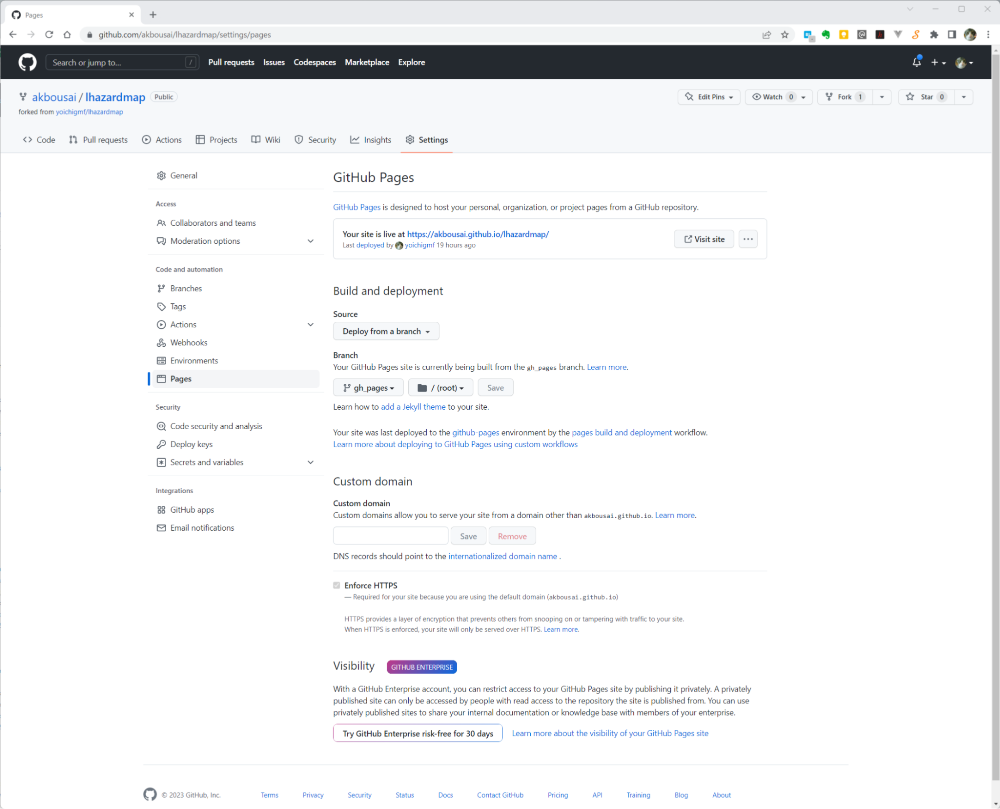

[メインページに戻る](./Readme.md) 